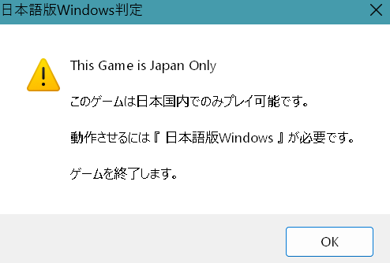
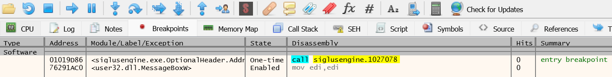
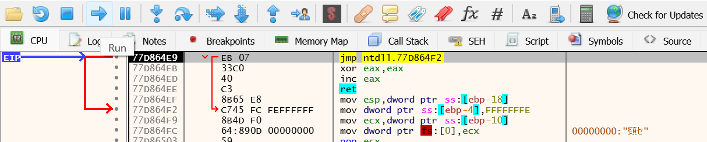
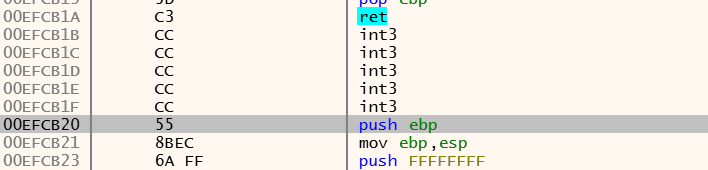
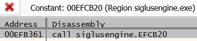
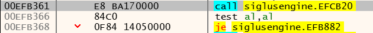
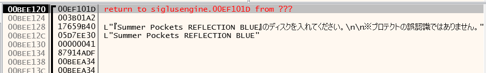

# 过区域验证

断点设置

在 cpu 视图点击两下`run`来到`MessageboxW`

双击这个`siglusengine.00EFCBDD`,来到`00EFCBDD`

往上寻找一推`int3`和一个`push ebp`

鼠标聚焦在`push ebp`,点击`Ctrl+R`

双击它,然后来到`00EFB361`

将这三句全部 nop 掉

# 过 DVD 验证

在 cpu 视图点击一下`run`来到`MessageboxW`

双击这个`siglusengine.00EF101D`

重复之前一样的步骤,往上寻找一推`int3`和一个`push ebp`,鼠标聚焦在`push ebp`,点击`Ctrl+R`,将这句`call` nop 掉

