主要解决这个问题
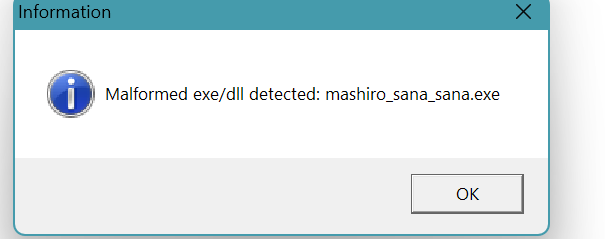

弄一个`FindResourceW`函数的断点
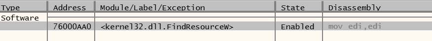

一直运行到右边出现`startup.tjs`
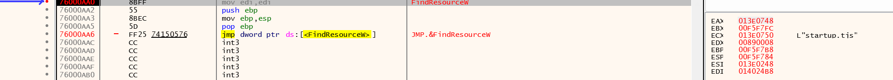

在弄一个`LockResource`函数的断点
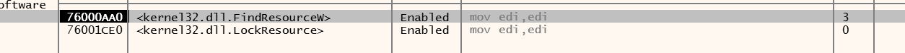

来到`LockResource`,点击图片右下角的`红色`的`009baebc`
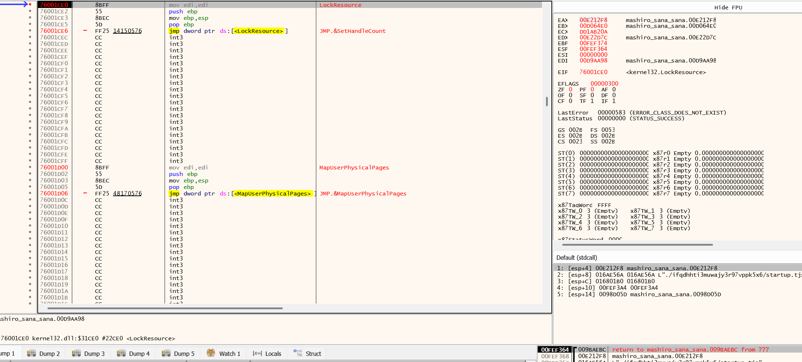

来到`009baebc`,
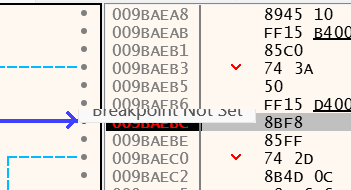

在这个设置一个断点,让程序运行到这里,查看图片右边`eax`的值`00E212F8`
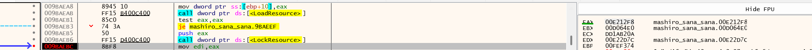

在 dump 页面,点击`ctrl+G`,输入`00E212F8`,来到`00E212F8`,
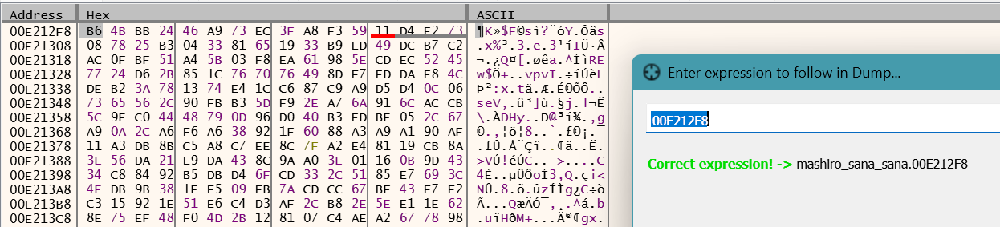

设置这个断点,清空其他断点
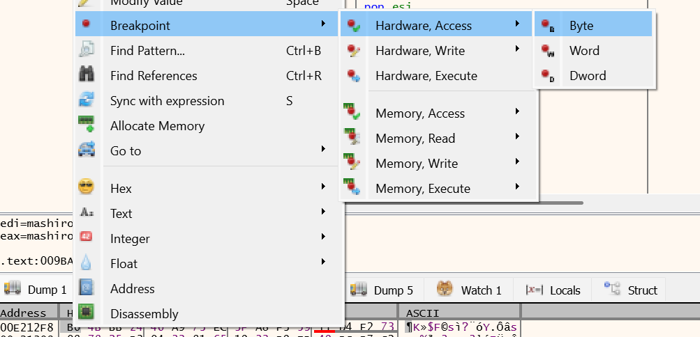
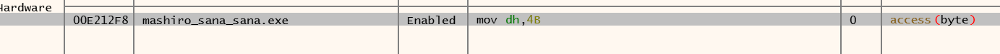

如果你要修改文件,可以先复制一下文件偏移
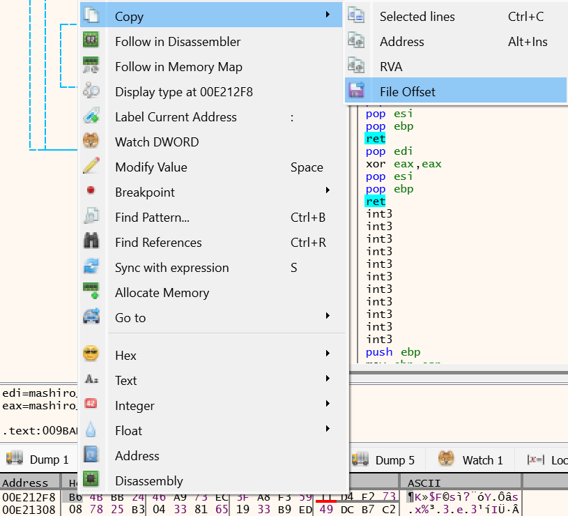

运行来到一个这样的地方
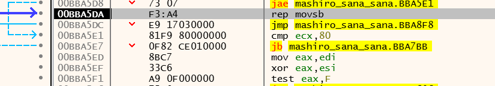

一直`F8`,来到类似于这种地方
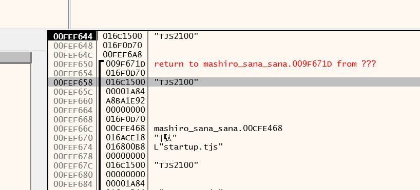

右键,选择`Follow DWORD in Current Dump`
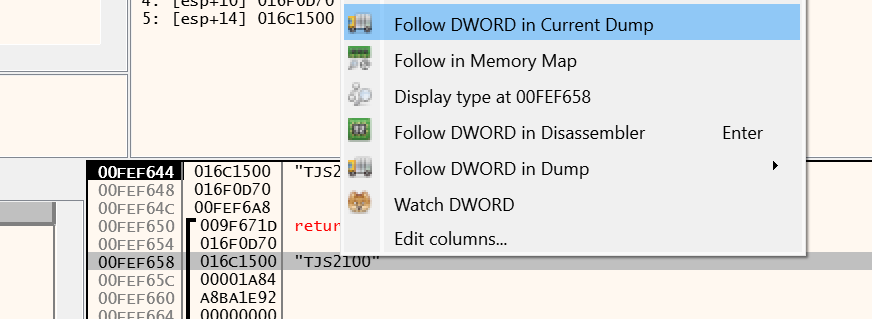

来到`016c1500`,如果你要修改文件,请记住这个地址
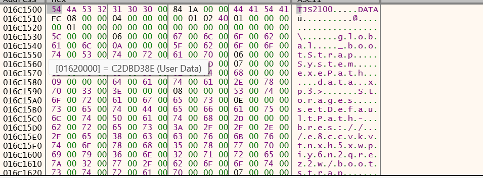

点击`ctrl+B`,搜索`F5FF060002001000`
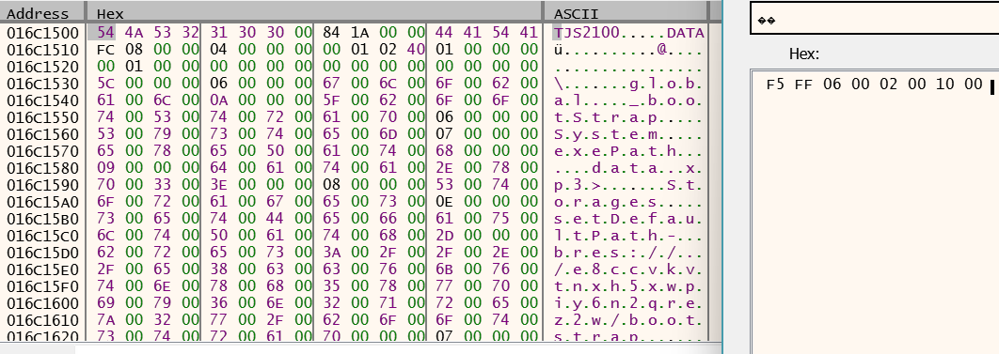

来到`016c22c8`,如果你要修改文件,请记住这个地址
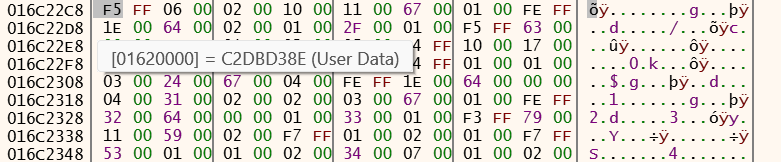

将`F5FF060002001000`修改成`F5FF050002001000`,然后取消全部断点,就可以运行了

---

接下来是修改文件

`016c22c8`-`016c1500`==`0000dc8`,再加上文件偏移之后就是`F5FF060002001000`的文件位置了
我们的目的是修改`06`到`05`,然后因为这个是被加密的,又不知道密钥,所以有四种情况,分别是,将 06 对应的那个位置
`-1`,`+1`,`-3`,`+3`,因为`06`,`05`和任何字节异或的差只会是这四种情况
