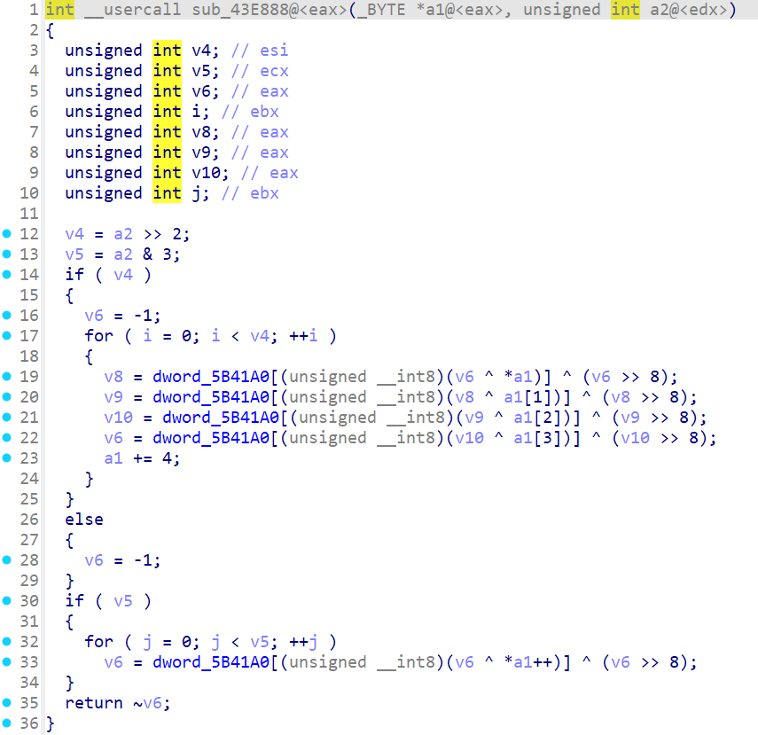

https://www.ymgal.games/co/article/136208542150426624

将游戏拖到 IDA,点击`Alt+T`,搜索`YPF`

点击`F5`生成伪代码

双击`sub_45DF0C`即可跳转到函数,想要回退,点击`Esc`

右键点击`dword_804858`,选择写入`dword_804858`的 xrefs

进入到`sub_45D844`

往下滑,右键点击`dword_80486C`,选择写入`edx`的 xrefs

进入到`sub_45D820`

右键点击`sub_45D820`,选择`Up`的,`Address`出现最多的 xrefs

## 找密钥

搜索`yst%05d.ybn`

跳转到写入`byte_804390` 的 xrefs

进入`sub_4623A4`

`sub_43E888`即获取密钥的函数,此处是 `crc32`

`off_5B4738`即输入的字符串,因此 `key=sub_43E888(off_5B4738)`

---

还可以通过应用程序来找到密钥,使用 16 进制打开`exe`,找到`_RDATA`节表(Section Table),假设`PointerToRawData`是`0x001CF800`,那么密钥就在`0x001CF850`附近
